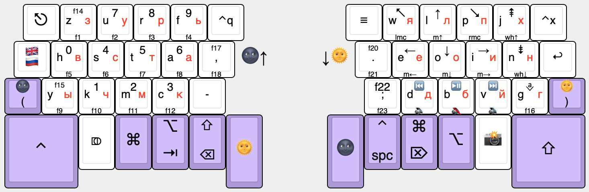

# litsrc/sequira.md

This file contains literate source for `sequira.h`. It mainly consists of
things that can be used in all keymaps. I have only one keymap for now, but
it may change later.

```c
#pragma once

#include "quantum.h"
```

## defconst Keyboard layers



- `LATIN 0`
  I use custom layout, not QWERTY. This layer also triggers when any mod is
  pressed, except of Shift.
- `CYRILLIC 1`
  Of course, not ЙЦУКЕН.
- `MOON 2`
  Navigation and numbers.
- `SUN 3`
  Mouse and F-keys.
- `ASTRA 4`
  Punctuation, etc. Typeable in any of the two languages.

## enum custom_key

The following are layermode keys.

- `CYR_LAT = SAFE_RANGE`
  Change layout on both keyboard and computer.
- `MUN_BRA`
  Momentary toggle Moon layer or enter open bracket `(`.
- `SUN_KET`
  Momentary toggle Sun layer or enter open bracket `)`.
- `LCMD`
  Just a `Left CMD/Super/GUI/Win` key.
- `ALT_TAB`
  Momentary toggle Left Alt mod or enter `Tab`.
- `CTL_SPC`
  Momentary toggle Right Ctrl mod or enter `Space`.
- `CMD_DEL`
  Momentary toggle `Right Super` mod or enter `Delete`.
- `ROPT`
  Just a `Right Alt/Option` key.
- `PHOTO`
  Momentary toggle `Moon` layer and `Super` along with `Shift`.

The following keys are from `Astra` layer.

- `AGUILL`
- `AEMOT`
  These are for writing guill-emots «». They depend on Compose key configured on computer like that: `Compose, <, <` → `«`, `Compose, >, >` → `»`. The Compose key must be mapped to ScrollLock.
- `AMDASH`
  Long dash — written with three hyphens.
- `APIPE`
- `ACIRC`
- `AGRAVE`
- `AATDOG`
- `AHASH`
- `ATILDE`
- `ADOLLAR`
- `AAMP`
- `ASHCH`
- `AJO`
- `AJU`
- `ASH`

The following key is used to toggle `ASTRA` layer, because on ЙЦУКЕН comma is typed with shift key pressed.

- `ASTRARUS`

## QMK Bonus imports

```c
#include "rusmap.h"
```

## Layout macros

They are used to simplify layout declaration in keymap. Edit with attention.

### defmacro HALF

Used as base for the other two.

- `k10, k11, k12, k13, k14, k15`
- `k20, k21, k22, k23, k24, k25`
- `k30, k31, k32, k33, k34, k35`
- `k40, k41, k42, k43, k44, k45`

```c
{ k10, k11, k12, k13, k14, k15 },
{ k20, k21, k22, k23, k24, k25 },
{ k30, k31, k32, k33, k34, k35 },
{ k40, k41, k42, k43, k44, k45 }
```

### defmacro HALFL

The left half.

- `k10, k11, k12, k13, k14, k15`
- `k21, k22, k23, k24, k25`
- `k31, k32, k33, k34, k35`

```c
HALF(k10,     k11,     k12,     k13,  k14,     k15,
     CYR_LAT, k21,     k22,     k23,  k24,     k25,
     MUN_BRA, k31,     k32,     k33,  k34,     k35,
     LT(SUN, KC_ESC), KC_LCTL, KC_SLCK, LCMD, ALT_TAB, MT(MOD_LSFT, KC_BSPC))
```

### defmacro HALFR

The right half.

- `k10, k11, k12, k13, k14, k15`
- `k21, k22, k23, k24, k20`
- `k31, k32, k33, k34, k30`

```c
HALF(k10,        k11,     k12,  k13,   k14,     k15,
     k20,        k21,     k22,  k23,   k24,     KC_ENT,
     k30,        k31,     k32,  k33,   k34,     SUN_KET,
     CTL_SPC,    CMD_DEL, ROPT, PHOTO, KC_RSFT, MO(MOON))
```

